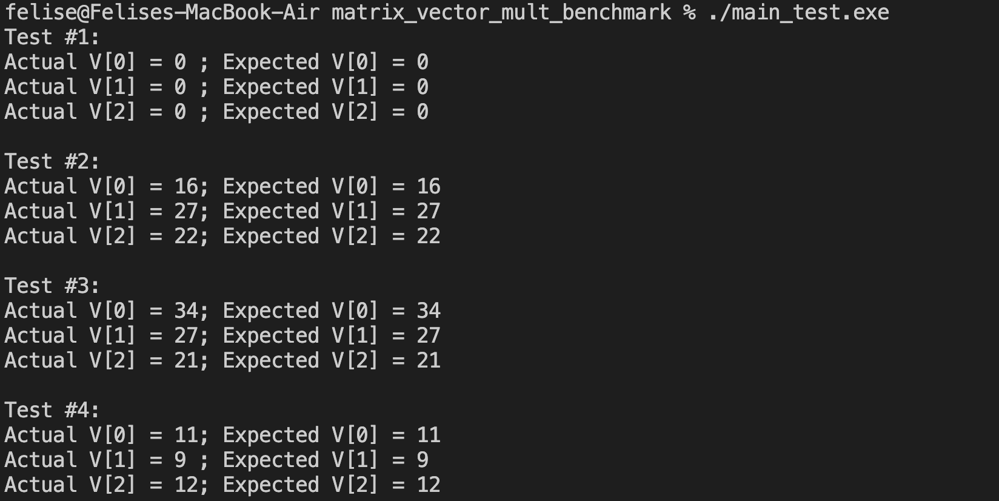
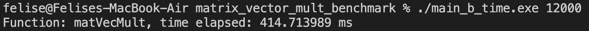
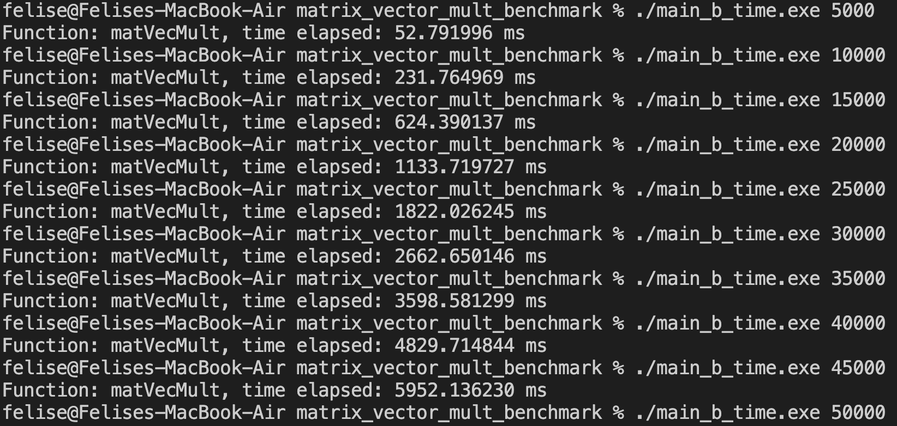
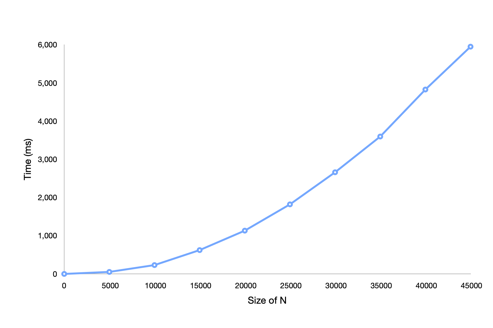
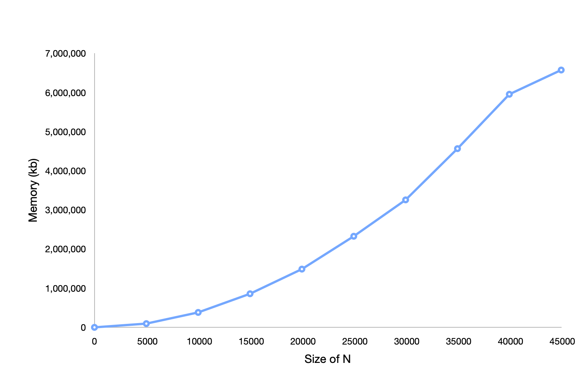

# Vector Matrix Multiplication Benchmark
The operating system used for this benchmarking process is Mac OS.

### Running The Program
To run the program, use ./main_test.exe

The output
 

### The Time Complexity
To find the time complexity, use ./main_b_time.exe <int>
Ps: Put in an actual integer in the <int>

As an example, if i put 12000 as the integer, the command will look like this:
./main_b_time.exe 12000

The Output
 

Below is the image showing the amount of time needed as the N gets higher:
 

Here is the time complexity graph:
 

### The Space Complexity
To find the space complexity, use ./main_b_space.exe <int>
Ps: Put in an actual integer in the <int>

As an example, if i put 800 as the integer, the command will look like this:
./main_b_space.exe 800

The Output will not be shown in the terminal, as i run this with Mac Os, so open activity monitor and click on the memory part to see the memory used when running the program.

Here is the memory used when i run ./main_b_space.exe 800:

Below are the images showing the amount of space needed as the N gets higher:
N = 0

N = 15000

N = 30000

N = 45000

And here is the space complexity graph:

